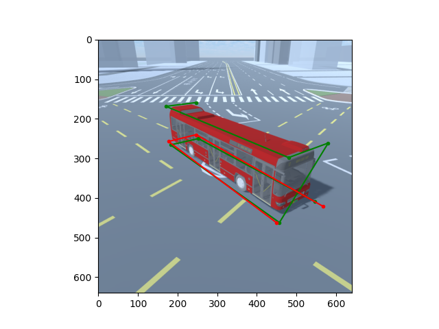

# foco_mono_gp
利用yolov8网络结构，通过修改单目推理车辆4个接地点

## 运行环境
- 操作系统：Linux
- Python

## 文件结构说明
- configs: 所有配置文件
- data: 主要是自定义dataset
- engine: 方法核心引擎
- tools: 各种工具

## 修改思路：
### 不改变整体网络架构: 修改DataSet --> 
1. 修改DataSet，使之能正确载入16个点(8对(x,y))数据，正确进行训练。
- 输入label，设定：(前：front, 后：end)；(左：left,右：right)；(上：top，下：bottom)。点的顺序从车头左下-->车尾左上，具体顺序为：前左下(flb)->后左下(elb)->后右下(erb)->前右下(frb)->前左上(flt)->前右上(frt)->后右上(ert)->后左上(elt)。见下图：

- 按照上述设定，中心点为：(flt+erb)/2, 对应为第3和第5个点。
2. 修改目标分配策略，主要是修改TaskAlignedAssigner
- 修改anchor点在真值范围内的：修改select_candidates_in_gts
- 
2. 修改head层，
- 将ltrb修改成flb, elb, erb, frb, flt, frt, ert, elt。每个点都包含(x,y)坐标。
- (2)修改损失函数;
- (3)修改后处理。具体内容参见“执行步骤”

## 执行步骤
### 1. 完成原始代码全链条，用以验证原始代码的可用性
#### 1.1 拉取文件、配置环境、安装框架及依赖等
##### 1.1.1 拉区文件及准备
- 创建文件夹：YOLOv8_GP，并进入文件夹
- git clone https://github.com/focoliao/YOLOv8_GP
- 拉取远程分支: git pull origin dev_V1.0:dev_V1.0, 并切换到分支: git switch dev_V1.0
##### 1.1.2 配置环境
- 使用之前gp环境：conda activate gp
- 根目录下运行python foco/tools/env_test_foco.py可以看到环境检测结果
##### 1.1.3 安装框架及依赖
- 在使用gp之后，似乎不用再安装这些了，可以正常跑预测
#### 1.2 测试predict: 由于ultralytics高度封装YOLOv8, 只能遵循ultralytics的要求，通过新建文件的方式调用。
- predict代码在foco/tools/test_original_yolov8_predict.py
- 对应配置在foco/configs/test_original_yolov8_predict.yaml中
- 运行python test_original_yolov8_predict.py即可完成预测
#### 1.3 测试train的pipeline
##### 1.3.1 准备数据集：
- 数据集图像存储：~/images/train/, ~/images/val/
- 数据集label存储：~/labels/train/, ~/labels/val/
##### 1.3.2 准备相应文件：
- 新建数据yaml文件，见foco/configs/test_original_yolov8_data.yaml
- train代码在foco/tools/test_original_yolov8_train.py
##### 1.3.3 训练及测试
- 运行 foco/tools/test_original_yolov8_train.py，可以看到结果
#### 1.4 验证完成，代码定义为V1.0， release V1.0
- 合并代码，删除本地开发分支，打V1.0 tag，推送到github，删除远程开发分支
- 远程发布release V1.0

### 2. 修改源代码
#### 冻结YOLOv8的卷积层部分（backbone），只训练Head层
#### 2.1 修改head层:由于需要自定义输出框，需要修改head层的内容
- 在cv2层，修改输出，从4修改为8。具体见ultralytics/nn/modules/head.py
- 对应reg_max部分，都从*4改成*8。具体见ultralytics/nn/modules/head.py
#### 2.2 修改损失函数
- 修改输出部分，从4修改为8。具体见ultralytics\utils\loss.py
- 增加自定义loss。具体见ultralytics\utils\loss.py
#### 2.3 修改predict：由于修改了输出框，需要更改predict的处理逻辑和输出内容
- 
#### 2.4 修改配置文件
- 新建数据yaml文件，见foco/configs/yolov8_gp_data.yaml。classes聚焦在道路物体上，不需要原始那么多分类。并按照自己定义的分类设置数据
- 新建训练yaml文件，见见foco/configs/yolov8_gp.yaml。
#### 2.5 修改train：
- 冻结head层之前的参数，不参与初始化训练。具体见：
- 
#### 2.6 修改DataLoader
- 具体见ultralytics\data\dataset.py。逐条处理人如下
- cache_labels：用于从文件中加载label并cache。实际在ultralytics\data\utils.py中的verify_image_label中,进行加载及处理逻辑。
- 修改判别为segment的逻辑，从>6改成>10：verify_image_label
- 修改xywh2xyxy，xyxy2xywh：变成直接输出，因为虽然我们让程序以为输入的为xywh，实际上，输入的是xyxy的16个点。ultralytics\utils\ops.py，ultralytics\data\augment.py _update_labels
- yolov8默认作了很多图像增强，在ultralytics\cfg\default.yaml中，将所有增强全都关闭：
  mosaic: 0.0          # Mosaic 关闭
  copy_paste: 0.0      # Copy-Paste 关闭
  mixup: 0.0           # MixUp 关闭
  degrees: 0.0         # 随机旋转角度设置为 0
  translate: 0.0       # 平移增强关闭
  scale: 0.0           # 缩放增强关闭
  shear: 0.0           # 剪切增强关闭
  perspective: 0.0     # 透视变换关闭
  hsv_h: 0.0           # 颜色增强关闭（色调调整）
  hsv_s: 0.0           # 颜色增强关闭（饱和度调整）
  hsv_v: 0.0           # 颜色增强关闭（亮度调整）
  flipud: 0.0          # 垂直翻转关闭
  fliplr: 0.0          # 水平翻转关闭
- 以上方法并不直接，在ultralytics\data\build.py buiild_yolo_dataset中，直接将augment设置为false(原始为augment=mode==train)
- 修改了loss计算时的缩放乘积问题。ultralytics\utils\loss.py __call__
- 通过以上内容，DataLoader基本修改完毕
#### 2.7 其他修改如计算公式等
- 修改修改xywh2xyxy，xyxy2xywh：变成直接输出，因为虽然我们让程序以为输入的为xywh，实际上，输入的是xyxy的16个点。ultralytics\utils\ops.py xyxy2xywh xywh2xyxy
- 修改select_candidates_in_gts: 修改lt(坐上)和rb(右下)计算逻辑。ultralytics/utils/tal.py TaskAlignedAssigner select_candidates_in_gts
### 3. 测试新代码
#### 3.1 测试train的pipeline
#### 3.2 测试predict